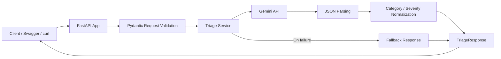
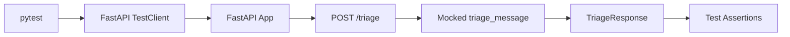
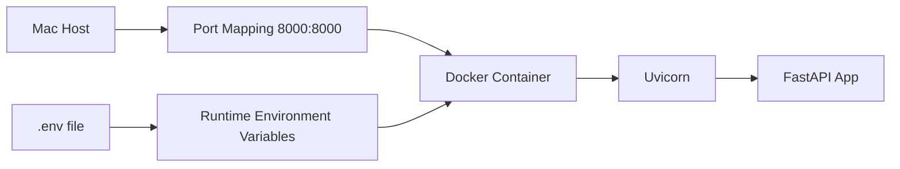

# LLM Support Triage API

A FastAPI-based backend service that analyzes customer support messages using Gemini API and returns structured triage results.

This project is designed as a Field Deployment Engineer (FDE)-oriented portfolio project. It focuses not only on calling an LLM API, but also on building a reliable and reproducible API workflow with request validation, response validation, normalization, fallback handling, logging, automated tests, and Docker-based execution.

---

## Project Overview

Customer support teams often receive many incoming issue reports with different levels of urgency. Manually classifying every issue can be slow and inconsistent.

This API receives a customer support message and returns a structured triage result:

* `category`
* `severity`
* `summary`
* `next_action`

The goal is to demonstrate how an LLM can be integrated into a production-aware backend API workflow.

---

## Problem

LLM-based applications often fail in practical backend workflows because their outputs can be inconsistent, unstructured, or difficult to consume by downstream systems.

For example, an LLM may return slightly different category names such as:

* `Payment`
* `Payments`
* `Billing`
* `Checkout Issue`

If an API consumer expects a stable response schema, this kind of variability can create integration problems.

This project addresses that issue by wrapping an LLM call inside a structured API workflow that includes:

* request validation
* response validation
* JSON parsing
* category normalization
* severity normalization
* fallback handling
* logging
* automated tests
* Dockerized execution

---

## Key Features

* FastAPI backend API
* Gemini API integration
* Pydantic request and response validation
* Structured JSON response format
* Category normalization
* Severity normalization
* Fallback response when LLM processing fails
* Logging for observability
* Automated API tests with pytest
* Mocked Gemini-dependent test flow using monkeypatch
* Dockerized API execution
* Environment variable injection using `.env`
* Mermaid architecture and workflow diagrams

---

## Tech Stack

* Python 3.12
* FastAPI
* Uvicorn
* Pydantic
* Gemini API
* python-dotenv
* pytest
* FastAPI TestClient
* Black
* isort
* Docker
* Mermaid

---

## Project Structure

```text
llm-support-triage-api/
├── app/
│   ├── __init__.py
│   ├── main.py
│   ├── config.py
│   ├── schemas/
│   │   ├── __init__.py
│   │   └── triage.py
│   └── services/
│       ├── __init__.py
│       └── triage_service.py
├── tests/
│   └── test_triage_api.py
├── Dockerfile
├── .dockerignore
├── README.md
├── requirements.txt
├── .gitignore
└── .env
```

> `.env` is used locally and should not be committed to GitHub.

---

## Architecture

### System Architecture



The API receives a support message from a client, validates the request body with Pydantic, sends the message to the triage service, calls Gemini API, parses and normalizes the response, and returns a structured `TriageResponse`.

If Gemini processing fails, the service logs the error and returns a fallback response that follows the same response schema.

---

### Test Flow



Automated tests use FastAPI's `TestClient` to exercise the API endpoints without starting a separate Uvicorn server.

The Gemini-dependent `triage_message` function is mocked with `monkeypatch`, so tests remain deterministic and do not depend on API keys, network availability, quota limits, or external LLM response variability.

---

### Docker Runtime Flow



The Docker container runs the FastAPI app with Uvicorn. The host machine maps local port `8000` to container port `8000`, making the API available at `http://127.0.0.1:8000`.

Secrets such as `GEMINI_API_KEY` are not baked into the Docker image. Instead, they are injected at runtime using `--env-file .env`.

---

## API Endpoints

### `GET /`

Health check endpoint.

#### Response

```json
{
  "message": "LLM Support Triage API is running"
}
```

---

### `POST /triage`

Analyzes a customer support message and returns a structured triage result.

#### Request Body

```json
{
  "message": "Payment is failing for all users after checkout"
}
```

#### Response Body

```json
{
  "category": "payment",
  "severity": "critical",
  "summary": "Payment issue detected.",
  "next_action": "Check payment gateway logs."
}
```

---

## Response Schema

The `/triage` endpoint returns the following response structure:

| Field         | Type   | Description                  |
| ------------- | ------ | ---------------------------- |
| `category`    | string | The issue category           |
| `severity`    | string | The urgency level            |
| `summary`     | string | A short summary of the issue |
| `next_action` | string | Recommended next step        |

---

## Allowed Categories

The API normalizes categories into one of the following values:

```text
authentication
payment
performance
deployment
integration
general
```

Examples:

| Raw LLM Output | Normalized Category |
| -------------- | ------------------- |
| `Payments`     | `payment`           |
| `billing`      | `payment`           |
| `auth`         | `authentication`    |
| `login`        | `authentication`    |
| `latency`      | `performance`       |
| `webhook`      | `integration`       |

Unknown categories are logged and normalized to:

```text
general
```

---

## Allowed Severities

The API normalizes severity into one of the following values:

```text
low
medium
high
critical
```

Unknown severity values are logged and normalized to:

```text
medium
```

This fallback is intentionally conservative. Returning `low` could hide potentially important issues, while returning `critical` too often could create alert fatigue.

---

## Reliability Features

This project includes several reliability-oriented safeguards.

### 1. Request Validation

The request body is validated using Pydantic.

The `/triage` endpoint requires a `message` field:

```json
{
  "message": "Login API returns 500 after deployment"
}
```

If the request body is invalid, FastAPI returns a `422` validation error before the endpoint logic is executed.

Example invalid request:

```json
{
  "text": "Payment is failing"
}
```

Expected behavior:

```text
422 Unprocessable Entity
```

---

### 2. Response Validation

The response is validated with a Pydantic response model.

The API must return:

```json
{
  "category": "payment",
  "severity": "critical",
  "summary": "...",
  "next_action": "..."
}
```

This prevents unexpected response structures from being returned to API users.

---

### 3. JSON Parsing Guard

The Gemini response is expected to be valid JSON.

If parsing fails, the service does not crash the application. Instead, it logs the error and returns a fallback response.

---

### 4. Category and Severity Normalization

LLM output can vary.

For example, Gemini may return:

```text
Payments
Billing
Auth
Latency
```

The service normalizes these values into a controlled set of allowed categories and severities.

This makes the API response more predictable and easier to consume by downstream systems.

---

### 5. Fallback Response

If Gemini API processing fails, the service returns a safe fallback response instead of breaking the API.

The fallback response follows the same response schema:

```json
{
  "category": "general",
  "severity": "medium",
  "summary": "Unable to complete automated triage.",
  "next_action": "Review the customer message manually and assign it to the appropriate support team."
}
```

---

### 6. Logging

The service uses Python logging to record important runtime events.

Examples:

* Gemini API call started
* Gemini API call succeeded
* Unknown category received
* Unknown severity received
* Gemini triage failed
* Fallback response returned

Logging helps with debugging, monitoring, and production troubleshooting.

---

## Testing

This project includes automated API tests using `pytest` and FastAPI's `TestClient`.

The tests verify:

* The root health endpoint returns a successful response.
* The `/triage` endpoint rejects invalid request bodies with a `422` validation error.
* The `/triage` endpoint returns a valid triage response using a mocked Gemini-dependent service function.
* The triage response follows the expected response contract.
* The `category` and `severity` fields are within the allowed values.
* The `summary` and `next_action` fields are strings.

The Gemini API call is mocked during tests using `pytest`'s `monkeypatch` fixture. This keeps the test suite fast, deterministic, and independent of API keys, network conditions, quota limits, or Gemini response variability.

### Run Tests

```bash
python3 -m pytest
```

Expected result:

```text
3 passed
```

Warnings from FastAPI, Starlette, or httpx may appear depending on dependency versions. The key result is that all tests pass.

---

## Current Test Coverage

Current tests cover:

| Test                                        | Purpose                                                                                  |
| ------------------------------------------- | ---------------------------------------------------------------------------------------- |
| `test_root_endpoint`                        | Verifies that `GET /` returns a successful health response                               |
| `test_triage_requires_message_field`        | Verifies that invalid request bodies return a `422` validation error                     |
| `test_triage_endpoint_with_mocked_response` | Verifies the successful `/triage` flow with the Gemini-dependent service function mocked |

---

## Why Mock Gemini in Tests?

The `/triage` endpoint depends on Gemini API in the actual service flow.

However, automated tests should not depend on:

* API keys
* External network availability
* Gemini quota limits
* Gemini response variability
* External API downtime
* Additional API cost

Therefore, the Gemini-dependent service function is mocked during tests.

Actual production flow:

```text
POST /triage
    ↓
FastAPI request validation
    ↓
triage endpoint
    ↓
triage_message()
    ↓
Gemini API call
    ↓
JSON parsing
    ↓
normalization
    ↓
TriageResponse
    ↓
JSON response
```

Test flow:

```text
POST /triage
    ↓
FastAPI request validation
    ↓
triage endpoint
    ↓
mocked fake_triage_message()
    ↓
TriageResponse
    ↓
JSON response
```

This allows the endpoint behavior to be tested without calling the actual Gemini API.

---

## Local Setup

### 1. Clone the Repository

```bash
git clone https://github.com/blue-monkey0/llm-support-triage-api.git
cd llm-support-triage-api
```

---

### 2. Create a Virtual Environment

```bash
python3 -m venv .venv
source .venv/bin/activate
```

---

### 3. Install Dependencies

```bash
pip3 install -r requirements.txt
```

---

### 4. Create `.env`

Create a `.env` file in the project root:

```text
GEMINI_API_KEY=your_gemini_api_key_here
```

Do not commit `.env` to GitHub.

---

### 5. Run the API Server Locally

```bash
uvicorn app.main:app --reload
```

The API will run at:

```text
http://127.0.0.1:8000
```

Swagger UI is available at:

```text
http://127.0.0.1:8000/docs
```

---

## Docker Setup

This project can also be executed inside a Docker container.

Docker makes the API easier to run in a reproducible environment without relying on the local Python virtual environment.

---

### 1. Build Docker Image

```bash
docker build -t llm-support-triage-api .
```

This command builds a Docker image using the `Dockerfile` in the project root.

---

### 2. Run Docker Container

```bash
docker run -p 8000:8000 --env-file .env --name triage-api llm-support-triage-api
```

This command:

* Runs the `llm-support-triage-api` image as a container.
* Maps local port `8000` to container port `8000`.
* Injects environment variables from `.env`.
* Assigns the container name `triage-api`.

The API will be available at:

```text
http://127.0.0.1:8000
```

Swagger UI will be available at:

```text
http://127.0.0.1:8000/docs
```

---

### 3. Stop Docker Container

```bash
docker stop triage-api
```

---

### 4. Remove Docker Container

```bash
docker rm triage-api
```

---

### 5. Run in Detached Mode

To run the container in the background:

```bash
docker run -d -p 8000:8000 --env-file .env --name triage-api llm-support-triage-api
```

Check running containers:

```bash
docker ps
```

View logs:

```bash
docker logs triage-api
```

Stop the container:

```bash
docker stop triage-api
```

Remove the container:

```bash
docker rm triage-api
```

---

### 6. Remove Stopped Containers

To remove all stopped containers:

```bash
docker container prune
```

---

## Docker Design Notes

### Why use `python:3.12-slim`?

The Docker image uses:

```dockerfile
FROM python:3.12-slim
```

This provides a lightweight Linux-based Python 3.12 environment.

---

### Why use `WORKDIR /app`?

```dockerfile
WORKDIR /app
```

This sets `/app` as the working directory inside the container.

---

### Why copy `requirements.txt` before copying `app/`?

```dockerfile
COPY requirements.txt .
RUN pip install --no-cache-dir -r requirements.txt
COPY app ./app
```

This allows Docker to cache dependency installation separately from application code changes.

If only the application code changes, Docker can reuse the dependency installation layer.

---

### Why use `--host 0.0.0.0`?

Inside Docker, Uvicorn must listen on all network interfaces so that requests from the host machine can reach the container.

```dockerfile
CMD ["uvicorn", "app.main:app", "--host", "0.0.0.0", "--port", "8000"]
```

Using `127.0.0.1` inside the container would only bind to the container's own localhost, which can make it inaccessible from the host machine.

---

### Why exclude `.env` from Docker image?

The `.env` file may contain sensitive secrets such as:

```text
GEMINI_API_KEY=...
```

For security, `.env` is excluded from the Docker image using `.dockerignore`.

Instead, environment variables are injected at runtime:

```bash
docker run --env-file .env ...
```

This prevents secrets from being baked into the Docker image.

---

## Example Request

Using `curl`:

```bash
curl -X POST \
  "http://127.0.0.1:8000/triage" \
  -H "Content-Type: application/json" \
  -d '{
    "message": "Payment is failing for all users after checkout"
  }'
```

Example response:

```json
{
  "category": "payment",
  "severity": "critical",
  "summary": "Payment issue detected.",
  "next_action": "Check payment gateway logs."
}
```

---

## Development Commands

### Run Server Locally

```bash
uvicorn app.main:app --reload
```

### Run Tests

```bash
python3 -m pytest
```

### Format Code

```bash
black app tests
```

### Sort Imports

```bash
isort app tests
```

### Run Formatter and Tests

```bash
isort app tests
black app tests
python3 -m pytest
```

### Build Docker Image

```bash
docker build -t llm-support-triage-api .
```

### Run Docker Container

```bash
docker run -p 8000:8000 --env-file .env --name triage-api llm-support-triage-api
```

### Stop Docker Container

```bash
docker stop triage-api
```

### Remove Docker Container

```bash
docker rm triage-api
```

---

## Week 1 Retrospective

### What I Built

I built an LLM-powered support triage API that receives a customer support message and returns a structured triage result.

The service is not just a direct wrapper around an LLM API. It includes a production-aware backend workflow with validation, normalization, fallback handling, logging, automated tests, and Dockerized execution.

---

### Key Technical Decisions

#### 1. Use FastAPI for the API Layer

FastAPI was chosen because it provides a clean way to define API endpoints, request models, response models, and automatically generated Swagger documentation.

It also integrates well with Pydantic, which made it useful for validating both incoming requests and outgoing responses.

---

#### 2. Use Pydantic Models for Request and Response Contracts

The API uses Pydantic models to define the expected input and output structure.

This keeps the API contract explicit:

* clients must send a `message` field
* the server must return `category`, `severity`, `summary`, and `next_action`

This helps prevent unexpected request and response shapes.

---

#### 3. Normalize LLM Output Before Returning It

LLM responses can vary even when the prompt asks for a specific structure.

To make the API more stable, the service normalizes category and severity values into controlled sets.

This makes the response easier to consume by downstream systems.

---

#### 4. Add Fallback Handling for LLM Failures

External LLM APIs can fail due to quota limits, network issues, invalid responses, or unexpected formatting.

Instead of allowing those failures to crash the API, the service returns a safe fallback response that follows the same schema.

This improves reliability and user experience.

---

#### 5. Mock Gemini During Automated Tests

The Gemini-dependent service function is mocked during endpoint tests.

This keeps tests:

* fast
* deterministic
* independent of API keys
* independent of network conditions
* independent of quota limits
* independent of Gemini response variability

This is closer to how production API workflows should be tested.

---

#### 6. Dockerize the API

The API was dockerized so it can run in a reproducible environment.

Secrets such as the Gemini API key are not included in the image. Instead, they are injected at runtime using an environment file.

This separates application code from sensitive configuration.

---

### Challenges

#### 1. LLM Response Variability

One challenge was that Gemini could return categories in slightly different formats, such as `Payments` instead of `payment`.

This was addressed with category and severity normalization.

---

#### 2. External API Dependency in Tests

Directly calling Gemini during tests would make the test suite slow, expensive, and unstable.

This was addressed by mocking the Gemini-dependent function with `monkeypatch`.

---

#### 3. Safe Secret Handling in Docker

The Gemini API key should not be copied into the Docker image.

This was addressed by excluding `.env` from the Docker build context and injecting it only at runtime.

---

### What I Learned

Through this project, I practiced building an LLM-powered API as a backend service rather than a simple chatbot.

I learned how to:

* structure a FastAPI project
* define request and response models with Pydantic
* integrate Gemini API into a backend service
* parse and validate LLM-generated JSON
* normalize unpredictable LLM outputs
* add fallback behavior for external API failures
* use logging for observability
* write endpoint tests with pytest and TestClient
* mock external API dependencies
* dockerize a FastAPI application
* pass secrets safely at runtime using environment variables
* document architecture and runtime behavior in a README

---

### Future Improvements

Potential improvements include:

* adding GitHub Actions CI
* adding more service-level unit tests
* improving prompt versioning
* making Gemini model name configurable with environment variables
* adding latency logging
* adding request IDs for traceability
* deploying the API to a cloud runtime
* adding a simple frontend or dashboard
* adding persistent storage for triage history

---

## Portfolio Explanation

This project demonstrates how to build a production-aware LLM-powered API service.

It includes:

* Backend API design with FastAPI
* Request and response validation with Pydantic
* Gemini API integration
* LLM response normalization
* Fallback handling for external API failures
* Logging for debugging and observability
* Automated API testing with pytest
* Mocking external API dependencies for deterministic tests
* Docker-based reproducible API execution
* README-based architecture and workflow documentation

A concise interview explanation:

```text
I built an LLM-powered customer support triage API using FastAPI and Gemini API.
The service receives a customer issue message and returns a structured triage result including category, severity, summary, and next action.
To make the API more production-aware, I added Pydantic validation, response normalization, fallback handling, logging, pytest-based endpoint tests, and Docker-based execution.
The Gemini-dependent service function is mocked during tests to keep the test suite deterministic and independent of external API availability.
The application can be run locally or inside a Docker container with environment variables injected at runtime.
I also documented the system architecture, test flow, and Docker runtime flow using Mermaid diagrams in the README.
```

---

## License

This project is for personal learning and portfolio purposes.
