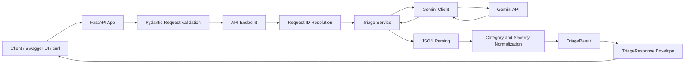
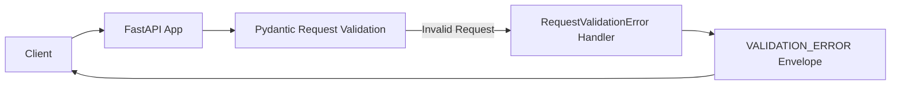
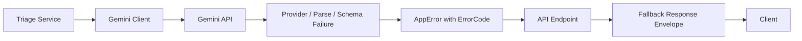

# LLM Support Triage API

HTTP API for classifying customer support messages into operational triage categories using an LLM-backed processing pipeline.

The service accepts a support message, calls Gemini through an isolated provider client, validates and normalizes the model output, and returns a stable response envelope for downstream consumers.

---

## Overview

`llm-support-triage-api` provides a triage endpoint for support automation workflows.

Given a customer support message, the API returns:

* normalized issue category
* normalized severity
* concise issue summary
* recommended next operational action
* request-scoped metadata
* structured error details for fallback, validation, or failure scenarios

The API is designed to make LLM output safer and easier to consume from backend services, support dashboards, internal tools, and automation pipelines.

---

## Key Capabilities

* FastAPI HTTP API
* Gemini API integration through an isolated client layer
* Pydantic request validation
* Pydantic response validation
* Stable v2 response envelope
* Standardized validation error responses
* Explicit success, fallback, and error states
* Machine-readable error codes
* Request ID generation
* Incoming `x-request-id` support
* Request-level metadata
* Latency measurement
* Category normalization
* Severity normalization
* JSON parsing guard for LLM responses
* Logging for operational troubleshooting
* Pytest-based API contract tests
* Service-layer tests with fake LLM clients
* Mockable LLM client interface
* Docker-based local runtime
* GitHub Actions CI for pull request validation
* Environment variable injection through `.env`

---

## Tech Stack

* Python 3.12
* FastAPI
* Uvicorn
* Pydantic
* Gemini API
* python-dotenv
* pytest
* FastAPI TestClient
* Black
* isort
* Docker
* GitHub Actions
* Mermaid

---

## Project Structure

```text
llm-support-triage-api/
├── .github/
│   └── workflows/
│       └── ci.yml
├── app/
│   ├── __init__.py
│   ├── main.py
│   ├── config.py
│   ├── clients/
│   │   ├── __init__.py
│   │   └── gemini_client.py
│   ├── core/
│   │   ├── __init__.py
│   │   ├── errors.py
│   │   └── request_context.py
│   ├── schemas/
│   │   ├── __init__.py
│   │   ├── common.py
│   │   └── triage.py
│   └── services/
│       ├── __init__.py
│       └── triage_service.py
├── tests/
│   ├── test_triage_api.py
│   └── test_triage_service.py
├── Dockerfile
├── .dockerignore
├── README.md
├── requirements.txt
├── .gitignore
└── .env
```

> `.env` is used for local development and should not be committed to source control.

---

## Architecture

### Layer Responsibilities

| Layer         | Path                             | Responsibility                                                                                          |
| ------------- | -------------------------------- | ------------------------------------------------------------------------------------------------------- |
| API layer     | `app/main.py`                    | Handles HTTP requests, creates response envelopes, registers exception handlers, and exposes endpoints. |
| Service layer | `app/services/triage_service.py` | Builds prompts, parses LLM output, normalizes values, and returns validated triage results.             |
| Client layer  | `app/clients/gemini_client.py`   | Owns direct communication with Gemini API.                                                              |
| Schema layer  | `app/schemas/`                   | Defines request, response, result, error, and metadata contracts.                                       |
| Core layer    | `app/core/`                      | Defines shared application errors, error codes, and request context helpers.                            |

---

### Request Flow



The API receives a support message from a client, validates the request body, resolves a request ID, sends the message to the triage service, calls Gemini through the provider client, parses the model response, normalizes category and severity values, and returns a stable response envelope.

---

### Validation Error Flow



Invalid request bodies are handled by a custom validation exception handler.

Instead of returning FastAPI's default validation error shape, the API returns the same v2 envelope structure used by the rest of the service.

---

### Fallback Flow



The service raises an application-level error when the LLM provider fails, the model response cannot be parsed, or the response does not match the expected schema.

The endpoint converts that application error into a structured fallback response.

---

## API Endpoints

### `GET /`

Basic service check.

#### Response

```json
{
  "message": "LLM Support Triage API is running"
}
```

---

### `GET /health`

Health check endpoint.

#### Response

```json
{
  "status": "ok"
}
```

This endpoint verifies that the API process is running and can respond to requests.

---

### `POST /triage`

Classifies a customer support message and returns a structured triage response.

#### Request Body

```json
{
  "message": "Users cannot log in with SSO after the latest deployment."
}
```

#### Success Response

```json
{
  "status": "success",
  "data": {
    "category": "authentication",
    "severity": "high",
    "summary": "Users cannot log in with SSO after the latest deployment.",
    "next_action": "Check SSO provider logs, validate token claims, and review authentication-related deployment changes."
  },
  "error": null,
  "metadata": {
    "request_id": "req_9f1c2d...",
    "model": "gemini-2.5-flash",
    "latency_ms": 842
  }
}
```

---

## Response Contract

The `/triage` endpoint returns a stable response envelope.

Clients should branch on `status` first and use `error.code` for programmatic error handling.

### Top-Level Fields

| Field      | Type           | Description                                                               |
| ---------- | -------------- | ------------------------------------------------------------------------- |
| `status`   | string         | Processing status. One of `success`, `fallback`, or `error`.              |
| `data`     | object or null | Validated triage result. Present when `status` is `success`.              |
| `error`    | object or null | Structured error details. Present when `status` is `fallback` or `error`. |
| `metadata` | object         | Request-scoped operational metadata.                                      |

---

### `status`

Allowed values:

```text
success
fallback
error
```

| Status     | Meaning                                                                                           |
| ---------- | ------------------------------------------------------------------------------------------------- |
| `success`  | The service produced a validated triage result.                                                   |
| `fallback` | The service could not produce a validated LLM result and returned a controlled fallback response. |
| `error`    | The request failed due to validation failure or an unexpected internal service error.             |

---

### `data`

`data` contains the validated triage result.

It is present only when `status` is `success`.

```json
{
  "category": "payment",
  "severity": "critical",
  "summary": "Checkout payments are failing for multiple users.",
  "next_action": "Check payment gateway health, recent deployment changes, and transaction failure logs."
}
```

#### Data Fields

| Field         | Type   | Description                            |
| ------------- | ------ | -------------------------------------- |
| `category`    | string | Normalized support issue category.     |
| `severity`    | string | Normalized operational severity.       |
| `summary`     | string | Concise summary of the customer issue. |
| `next_action` | string | Recommended next operational action.   |

---

### `error`

`error` contains structured failure details.

It is `null` when `status` is `success`.

```json
{
  "code": "LLM_PARSE_ERROR",
  "message": "The model response could not be parsed as valid JSON."
}
```

#### Error Fields

| Field     | Type   | Description                        |
| --------- | ------ | ---------------------------------- |
| `code`    | string | Machine-readable error code.       |
| `message` | string | Human-readable diagnostic message. |

Clients should use `error.code` for control flow.
Clients should not parse `error.message`.

---

### `metadata`

`metadata` contains request-scoped operational information.

```json
{
  "request_id": "req_9f1c2d...",
  "model": "gemini-2.5-flash",
  "latency_ms": 842
}
```

#### Metadata Fields

| Field        | Type            | Description                                     |
| ------------ | --------------- | ----------------------------------------------- |
| `request_id` | string          | Unique identifier for tracing a single request. |
| `model`      | string or null  | LLM model used for the request.                 |
| `latency_ms` | integer or null | End-to-end request latency in milliseconds.     |

---

## Request ID Handling

The API supports request-scoped tracing through `metadata.request_id`.

If the client sends an `x-request-id` header, the API uses that value.

If the client does not send an `x-request-id` header, the API generates a new request ID.

### Client-Provided Request ID

```bash
curl -X POST "http://127.0.0.1:8000/triage" \
  -H "Content-Type: application/json" \
  -H "x-request-id: req_manual_test_001" \
  -d '{
    "message": "Users cannot log in with SSO after deployment."
  }'
```

Example response:

```json
{
  "status": "success",
  "data": {
    "category": "authentication",
    "severity": "high",
    "summary": "Users cannot log in with SSO after deployment.",
    "next_action": "Check SSO provider logs, token claims, and recent authentication-related deployment changes."
  },
  "error": null,
  "metadata": {
    "request_id": "req_manual_test_001",
    "model": "gemini-2.5-flash",
    "latency_ms": 842
  }
}
```

Request IDs should be included in logs and client-reported incidents to support request-level troubleshooting.

---

## Validation Error Handling

Invalid request bodies are returned using the same response envelope as the rest of the API.

### Missing Required Field

Request:

```bash
curl -X POST "http://127.0.0.1:8000/triage" \
  -H "Content-Type: application/json" \
  -H "x-request-id: req_validation_test_001" \
  -d '{
    "text": "Payment failed after checkout."
  }'
```

Response:

```json
{
  "status": "error",
  "data": null,
  "error": {
    "code": "VALIDATION_ERROR",
    "message": "Request validation failed."
  },
  "metadata": {
    "request_id": "req_validation_test_001",
    "model": null,
    "latency_ms": null
  }
}
```

### Empty Message

Request:

```bash
curl -X POST "http://127.0.0.1:8000/triage" \
  -H "Content-Type: application/json" \
  -H "x-request-id: req_empty_message_test_001" \
  -d '{
    "message": ""
  }'
```

Response:

```json
{
  "status": "error",
  "data": null,
  "error": {
    "code": "VALIDATION_ERROR",
    "message": "Request validation failed."
  },
  "metadata": {
    "request_id": "req_empty_message_test_001",
    "model": null,
    "latency_ms": null
  }
}
```

Validation errors use HTTP `422 Unprocessable Entity`.

---

## Allowed Categories

The API normalizes model output into one of the following category values:

```text
authentication
payment
performance
deployment
integration
general
```

### Category Examples

| Raw LLM Output | Normalized Category |
| -------------- | ------------------- |
| `auth`         | `authentication`    |
| `login`        | `authentication`    |
| `sso`          | `authentication`    |
| `billing`      | `payment`           |
| `payments`     | `payment`           |
| `checkout`     | `payment`           |
| `latency`      | `performance`       |
| `timeout`      | `performance`       |
| `deploy`       | `deployment`        |
| `rollback`     | `deployment`        |
| `webhook`      | `integration`       |
| `third-party`  | `integration`       |

Unknown category values are normalized to:

```text
general
```

---

## Allowed Severities

The API normalizes model output into one of the following severity values:

```text
low
medium
high
critical
```

Unknown severity values are normalized to:

```text
medium
```

This default is intentionally conservative. Returning `low` can hide important issues, while returning `critical` too often can create alert fatigue.

---

## Error Codes

| Code                 | Meaning                                                            | Typical Cause                                                    |
| -------------------- | ------------------------------------------------------------------ | ---------------------------------------------------------------- |
| `LLM_PROVIDER_ERROR` | The upstream LLM provider failed.                                  | API key issue, provider outage, quota limit, or network failure. |
| `LLM_PARSE_ERROR`    | The model response could not be parsed as JSON.                    | Gemini returned prose, markdown, or malformed JSON.              |
| `LLM_SCHEMA_ERROR`   | The model response was JSON but did not match the expected schema. | Missing `category`, `severity`, `summary`, or `next_action`.     |
| `VALIDATION_ERROR`   | The request body failed validation.                                | Missing or empty `message` field.                                |
| `INTERNAL_ERROR`     | Unexpected server-side failure.                                    | Unhandled application error.                                     |

---

## Gemini Client

Gemini API access is isolated in `app/clients/gemini_client.py`.

The client layer owns provider-specific details such as:

* Gemini SDK client initialization
* model name
* provider request execution
* raw response text extraction
* provider-level logging

The service layer does not directly import or call the Gemini SDK.
It depends on a client interface that exposes `generate_content(prompt: str) -> str`.

This keeps the triage service focused on application logic:

* prompt construction
* response parsing
* response validation
* category normalization
* severity normalization
* domain result creation

This separation makes the service easier to test and reduces coupling between business logic and provider-specific implementation details.

---

## Example Requests

### curl

```bash
curl -X POST "http://127.0.0.1:8000/triage" \
  -H "Content-Type: application/json" \
  -d '{
    "message": "Users cannot log in with SSO after the latest deployment."
  }'
```

### curl with `x-request-id`

```bash
curl -X POST "http://127.0.0.1:8000/triage" \
  -H "Content-Type: application/json" \
  -H "x-request-id: req_manual_test_001" \
  -d '{
    "message": "Users cannot log in with SSO after the latest deployment."
  }'
```

### Swagger UI

Swagger UI is available at:

```text
http://127.0.0.1:8000/docs
```

Use the `POST /triage` endpoint and provide the following request body:

```json
{
  "message": "Users cannot log in with SSO after the latest deployment."
}
```

Swagger UI and curl send the same underlying HTTP request when the method, URL, headers, and JSON body match.

---

## Example Responses

### Success

```json
{
  "status": "success",
  "data": {
    "category": "authentication",
    "severity": "high",
    "summary": "Users cannot log in with SSO after the latest deployment.",
    "next_action": "Check SSO provider logs, validate token claims, and review authentication-related deployment changes."
  },
  "error": null,
  "metadata": {
    "request_id": "req_9f1c2d...",
    "model": "gemini-2.5-flash",
    "latency_ms": 842
  }
}
```

### Fallback: Provider Error

```json
{
  "status": "fallback",
  "data": null,
  "error": {
    "code": "LLM_PROVIDER_ERROR",
    "message": "The upstream LLM provider returned an error."
  },
  "metadata": {
    "request_id": "req_9f1c2d...",
    "model": "gemini-2.5-flash",
    "latency_ms": 1032
  }
}
```

### Fallback: Parse Error

```json
{
  "status": "fallback",
  "data": null,
  "error": {
    "code": "LLM_PARSE_ERROR",
    "message": "The model response could not be parsed as valid JSON."
  },
  "metadata": {
    "request_id": "req_9f1c2d...",
    "model": "gemini-2.5-flash",
    "latency_ms": 917
  }
}
```

### Fallback: Schema Error

```json
{
  "status": "fallback",
  "data": null,
  "error": {
    "code": "LLM_SCHEMA_ERROR",
    "message": "The model response is missing one or more required fields."
  },
  "metadata": {
    "request_id": "req_9f1c2d...",
    "model": "gemini-2.5-flash",
    "latency_ms": 911
  }
}
```

### Validation Error

```json
{
  "status": "error",
  "data": null,
  "error": {
    "code": "VALIDATION_ERROR",
    "message": "Request validation failed."
  },
  "metadata": {
    "request_id": "req_validation_test_001",
    "model": null,
    "latency_ms": null
  }
}
```

### Internal Error

```json
{
  "status": "error",
  "data": null,
  "error": {
    "code": "INTERNAL_ERROR",
    "message": "Unexpected server error occurred."
  },
  "metadata": {
    "request_id": "req_9f1c2d...",
    "model": "gemini-2.5-flash",
    "latency_ms": 24
  }
}
```

---

## Reliability Design

### Request Validation

The request body is validated before endpoint logic is executed.

Valid request:

```json
{
  "message": "Login API returns 500 after deployment."
}
```

Invalid request:

```json
{
  "text": "Login API returns 500 after deployment."
}
```

Invalid requests are rejected by FastAPI/Pydantic validation before calling Gemini.

Validation failures are returned as structured `VALIDATION_ERROR` envelopes.

---

### Response Validation

The endpoint uses a Pydantic response model.

This ensures the API returns the documented response envelope:

```json
{
  "status": "success",
  "data": {
    "category": "authentication",
    "severity": "high",
    "summary": "...",
    "next_action": "..."
  },
  "error": null,
  "metadata": {
    "request_id": "req_...",
    "model": "gemini-2.5-flash",
    "latency_ms": 842
  }
}
```

---

### LLM Output Normalization

LLM outputs can vary even when prompted with a fixed schema.

The service normalizes category and severity values before returning a response.

This protects downstream consumers from minor wording variations in model output.

---

### Provider Isolation

Gemini-specific implementation details are isolated in the client layer.

This prevents the service layer from depending directly on provider SDK details and makes the codebase easier to adapt if the provider changes later.

For example, replacing Gemini with another LLM provider should primarily affect the client layer, not the triage service or API response contract.

---

### Fallback Handling

The service does not return fake successful triage data when LLM processing fails.

Instead, LLM failures are converted into fallback responses:

```json
{
  "status": "fallback",
  "data": null,
  "error": {
    "code": "LLM_PARSE_ERROR",
    "message": "The model response could not be parsed as valid JSON."
  },
  "metadata": {
    "request_id": "req_...",
    "model": "gemini-2.5-flash",
    "latency_ms": 932
  }
}
```

This allows clients to route fallback cases to manual review, retry, or operational monitoring workflows.

---

### Request Metadata

Each triage response includes request-scoped metadata.

The most important field is `request_id`.

Clients can use `request_id` when reporting issues, and operators can use the same ID to correlate logs for a specific request.

---

## Logging

The service uses Python logging to record runtime events.

Typical events include:

* Gemini API call started
* Gemini API call succeeded
* unknown category received
* unknown severity received
* request validation failure
* LLM provider failure
* LLM parse failure
* LLM schema failure
* fallback response returned
* unexpected server error

Current log format:

```text
%(asctime)s %(levelname)s [%(name)s] %(message)s
```

Example validation error log:

```text
2026-06-30 20:30:00 WARNING [app.main] Request validation failed path=/triage request_id=req_validation_test_001 error_code=VALIDATION_ERROR errors=[...]
```

Example fallback log:

```text
2026-06-30 20:31:00 WARNING [app.main] Triage request returned fallback response request_id=req_abc error_code=LLM_PARSE_ERROR latency_ms=932
```

Example success log:

```text
2026-06-30 20:32:00 INFO [app.main] Triage request succeeded request_id=req_abc latency_ms=842 model=gemini-2.5-flash
```

---

## Testing

This project uses `pytest` and FastAPI's `TestClient`.

The test suite covers both the HTTP API contract and the service-layer LLM handling logic.

### API Contract Tests

`tests/test_triage_api.py` verifies:

* `GET /` returns the root service message.
* `GET /health` returns `{"status": "ok"}`.
* `POST /triage` returns the v2 response envelope for successful requests.
* success responses include `status`, `data`, `error`, and `metadata`.
* `data.category` is one of the allowed categories.
* `data.severity` is one of the allowed severities.
* client-provided `x-request-id` is preserved in `metadata.request_id`.
* a request ID is generated when `x-request-id` is missing.
* missing `message` fields return HTTP `422`.
* empty `message` values return HTTP `422`.
* validation errors return `status = error`.
* validation errors include `error.code = VALIDATION_ERROR`.
* application-level LLM failures return `status = fallback`.
* unexpected server errors return `status = error`.

### Service-Layer Tests

`tests/test_triage_service.py` verifies:

* markdown-wrapped JSON can be parsed.
* valid model responses are converted into `TriageResult`.
* category aliases are normalized.
* unknown severity values are normalized to `medium`.
* provider failures raise `AppError` with `LLM_PROVIDER_ERROR`.
* malformed JSON raises `AppError` with `LLM_PARSE_ERROR`.
* missing response fields raise `AppError` with `LLM_SCHEMA_ERROR`.

### Test Command

```bash
python3 -m pytest
```

The tests mock Gemini-dependent flows so the suite does not require a real API key or network call.

---

## Why Mock the LLM Client in Tests?

The `/triage` endpoint depends on Gemini in the actual service flow.

Automated tests should not depend on:

* API keys
* external network availability
* Gemini quota limits
* Gemini response variability
* external API downtime
* additional API cost

The Gemini client should be mocked during tests so the test suite remains fast, deterministic, and reliable.

The service function accepts an optional LLM client dependency, which allows tests to inject a fake client without calling the real provider.

---

## Local Development

### 1. Clone Repository

```bash
git clone https://github.com/blue-monkey0/llm-support-triage-api.git
cd llm-support-triage-api
```

---

### 2. Create Virtual Environment

```bash
python3 -m venv .venv
source .venv/bin/activate
```

---

### 3. Install Dependencies

```bash
pip3 install -r requirements.txt
```

---

### 4. Create `.env`

Create a `.env` file in the project root:

```text
GEMINI_API_KEY=your_gemini_api_key_here
```

Do not commit `.env` to source control.

---

### 5. Run API Server

```bash
uvicorn app.main:app --reload
```

The API runs at:

```text
http://127.0.0.1:8000
```

Swagger UI is available at:

```text
http://127.0.0.1:8000/docs
```

---

## Continuous Integration

This project uses GitHub Actions for CI.

The workflow file is located at:

```text
.github/workflows/ci.yml
```

The CI workflow runs automatically when:

* a pull request is opened or updated
* code is pushed to the `main` branch

The workflow verifies that the project can be tested, formatted, and built in a clean Linux environment.

---

### CI Checks

The workflow runs the following checks:

```text
1. Check out repository code
2. Set up Python 3.12
3. Install dependencies from requirements.txt
4. Check import sorting with isort
5. Check code formatting with black
6. Run pytest
7. Build Docker image
```

These checks are intended to catch common integration problems before code is merged.

---

### Workflow Configuration

```yaml
name: CI

on:
  pull_request:
  push:
    branches:
      - main

jobs:
  test:
    name: Test, Format, and Build
    runs-on: ubuntu-latest

    env:
      GEMINI_API_KEY: dummy-api-key-for-ci

    steps:
      - name: Checkout repository
        uses: actions/checkout@v4

      - name: Set up Python
        uses: actions/setup-python@v5
        with:
          python-version: "3.12"

      - name: Install dependencies
        run: |
          python -m pip install --upgrade pip
          pip install -r requirements.txt

      - name: Check import sorting
        run: isort --check-only app tests

      - name: Check code formatting
        run: black --check app tests

      - name: Run tests
        run: python -m pytest

      - name: Build Docker image
        run: docker build -t llm-support-triage-api .
```

---

### Why the CI Uses a Dummy Gemini API Key

The CI environment sets:

```text
GEMINI_API_KEY=dummy-api-key-for-ci
```

The test suite should not call the real Gemini API.

API tests use monkeypatching, and service-layer tests use fake LLM clients to avoid external network calls, real API keys, provider quota usage, and nondeterministic model responses.

The dummy key exists only to make application imports safe in CI.

---

### Local CI Equivalent

Before opening a pull request, run the same checks locally:

```bash
isort --check-only app tests
black --check app tests
python3 -m pytest
docker build -t llm-support-triage-api .
```

If formatting checks fail, apply formatting locally:

```bash
isort app tests
black app tests
```

Then rerun the checks.

---

### CI Design Notes

The workflow intentionally performs checks rather than modifying code.

For example:

```bash
isort --check-only app tests
black --check app tests
```

These commands fail the workflow if formatting is incorrect, but they do not rewrite files inside CI.

This keeps formatting changes explicit and reviewable in the developer's branch.

---

## Docker

### Build Image

```bash
docker build -t llm-support-triage-api .
```

### Run Container

```bash
docker run -p 8000:8000 --env-file .env --name triage-api llm-support-triage-api
```

The API will be available at:

```text
http://127.0.0.1:8000
```

### Stop Container

```bash
docker stop triage-api
```

### Remove Container

```bash
docker rm triage-api
```

### Run in Detached Mode

```bash
docker run -d -p 8000:8000 --env-file .env --name triage-api llm-support-triage-api
```

View logs:

```bash
docker logs triage-api
```

---

## Docker Design Notes

### Base Image

The Docker image uses:

```dockerfile
FROM python:3.12-slim
```

This provides a lightweight Python 3.12 runtime.

---

### Working Directory

```dockerfile
WORKDIR /app
```

This sets `/app` as the working directory inside the container.

---

### Dependency Layer Caching

```dockerfile
COPY requirements.txt .
RUN pip install --no-cache-dir -r requirements.txt
COPY app ./app
```

Dependencies are copied and installed before application code to improve Docker build caching.

If only application code changes, Docker can reuse the dependency installation layer.

---

### Runtime Host Binding

Inside Docker, Uvicorn should bind to all network interfaces:

```dockerfile
CMD ["uvicorn", "app.main:app", "--host", "0.0.0.0", "--port", "8000"]
```

Using `0.0.0.0` allows the host machine to reach the API through Docker port mapping.

---

### Secret Handling

Secrets such as `GEMINI_API_KEY` should not be baked into the Docker image.

Use runtime environment injection instead:

```bash
docker run --env-file .env ...
```

---

## Development Commands

### Run Server Locally

```bash
uvicorn app.main:app --reload
```

### Run Tests

```bash
python3 -m pytest
```

### Format Code

```bash
black app tests
```

### Sort Imports

```bash
isort app tests
```

### Format and Test

```bash
isort app tests
black app tests
python3 -m pytest
```


### Run CI Checks Locally

```bash
isort --check-only app tests
black --check app tests
python3 -m pytest
docker build -t llm-support-triage-api .
```

### Build Docker Image

```bash
docker build -t llm-support-triage-api .
```

### Run Docker Container

```bash
docker run -p 8000:8000 --env-file .env --name triage-api llm-support-triage-api
```

---

## Operational Notes

### Client Handling

Clients should branch on `status` first.

Recommended handling:

```text
if status == "success":
    consume data
elif status == "fallback":
    route to manual review or retry workflow
elif status == "error":
    inspect error.code and handle according to API contract
```

Clients should use `error.code` for programmatic handling.

Clients should not parse `error.message`.

---

### Validation Error Semantics

Validation errors indicate that the client request did not match the required request schema.

Typical causes:

* missing `message` field
* empty `message` value
* invalid request body format

Validation errors return HTTP `422` and use the standard response envelope with:

```text
status = error
error.code = VALIDATION_ERROR
data = null
```

---

### Fallback Semantics

Fallback responses indicate that the API server handled the request but could not produce a validated LLM triage result.

Typical fallback causes:

* LLM provider call failed
* LLM response was not valid JSON
* LLM response was missing required fields

Fallback responses should generally be routed to manual review, retry, or operational monitoring workflows.

---

### Request ID Usage

Each response includes `metadata.request_id`.

Use this value when investigating request-specific issues.

Example:

```text
request_id=req_9f1c2d...
```

This ID can be used to correlate API responses with server logs.

If a client provides `x-request-id`, the API preserves that value in the response metadata.

---

### Provider Client Boundary

Provider-specific code should remain inside `app/clients`.

The service layer should avoid importing provider SDKs directly.

This keeps the application easier to test, easier to maintain, and easier to migrate to another provider if needed.

---

## Version

Current API version:

```text
0.2.0
```

This version includes:

* v2 response envelope
* structured error object
* request metadata
* Gemini provider client isolation
* standardized validation error responses
* `x-request-id` support
* API and service-layer test coverage
* GitHub Actions CI for test, format, and Docker build checks
* API contract tests for success, validation, fallback, and internal error responses
* service-layer tests for provider, parse, and schema failure handling

---

## License

Internal development and demonstration use.
